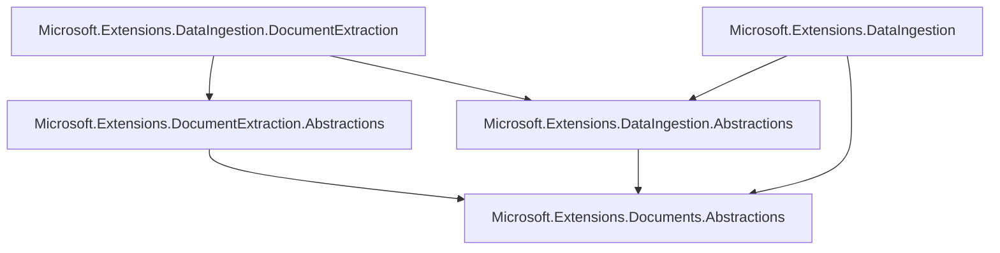

# Neutral shared document tree comparison

> **DO NOT MERGE:** This is the preferred strategic comparison for Adam's architecture decision, not a merge candidate.

## Dependency direction

The shared package contains only the semantic value and a `System.Memory` compatibility reference for older target frameworks. It does not reference Document Extraction, Data Ingestion, VectorData, or AI. Core MEDI does not reference Document Extraction; the dedicated integration package owns client-to-reader composition.

## Semantic and evidence boundary

`Document` is one immutable ordered tree. Stable `DocumentNodeId` values identify text, containers, tables, cell content, and images. Logical sections, lists, list items, and quotes remain containers. `DocumentPageReference` annotations preserve physical provenance without introducing page containers or multi-parent traversal.

Extraction geometry, confidence, raw provider objects, and provider properties live in `DocumentExtractionEvidence`, keyed by shared node ID. Page dimensions, coordinate frames, exact provider Markdown, and streaming envelopes remain extraction concerns.

`Document.Text` and `DocumentTextProjection` are the only plain-text projection. They use fixed `\n` separators. There is no independently supplied text authority. Exact provider Markdown remains nullable on `DocumentPage`; it is neither parsed into the tree nor synthesized from it, and results do not aggregate it.

Streaming reduction sorts page fragments and concatenates their root nodes. IDs must be unique across fragments. It deliberately does not infer a logical container spanning pages.

## Compatibility implications

`IngestionDocument` remains only as a thin ingestion identity/context wrapper around `Document`. The previous MEDI element hierarchy was removed rather than retained as a competing authority. Existing MEDI readers and processors must construct or immutably rewrite shared nodes. Existing Markdown-first element constructors are source-breaking preview changes.

Serialization and schema versioning are intentionally deferred. Adding them would create a cross-package compatibility commitment that is not required for executable composition.

## Measured comparison

Measurements are against common base `1fec8651d88b19ae855c39239e75645c548e5dde`; bridge figures come from the pinned comparison evidence.

| Measure | Bridge evidence | Shared-tree implementation |
|---|---:|---:|
| Production lines changed | +855/-38 | +1,242/-1,666 |
| Test lines changed | +353/-2 | +441/-2,601 |
| New shared/integration public types | 0 | 14 |
| Shared package public signatures | 0 | 50 across 13 types |
| Integration package public signatures | reader in MEDI | 2 across 1 type |
| MEDI semantic types replaced | 0 | 7; `IngestionDocument` retained only as context |
| Neutral-package product dependencies | N/A | 0 |
| Consumer-owned mapping | 0 | 0 |

The shared direction does not have fewer total domain types: extraction operations/evidence, ingestion contexts/processors/chunks/writers, and the neutral semantic value remain separate concepts.

## Exercised contracts

The focused corpus covers literal text versus Markdown, headings and code language, logical lists and quotes, nested and spanned tables, captioned and captionless images, empty and Markdown-only extraction pages, multiple pages, typed page provenance, authored Markdown production, chunking, source-node provenance, pipeline writing, evidence isolation, and independent use of the neutral package.

## Open decisions

1. Whether the larger coordinated breaking change is justified versus the smaller bridge.
2. Whether immutable processor rewrite ergonomics need first-class helpers.
3. Whether future serialization should be versioned in this package or owned by a separate format package.
4. Whether streamed page fragments need an explicit provider hook for reconstructing cross-page logical containers.
5. Whether binary-image chunk production belongs in core MEDI or in an image-specific chunker.
